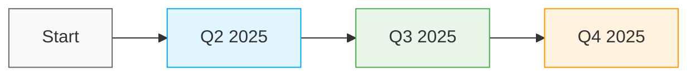

# AOF Østlandet Nettside 🎓

## 🗺️ Produktveikart 2025
> *Vår visjon for en moderne og brukervennlig læringsplattform*

### 🎯 Brukeropplevelse


| Status | Funksjon | Prioritet | Beskrivelse |
|--------|----------|-----------|-------------|
| 🔄 | **Kurskatalog** | HØYT | Søkbar oversikt med avanserte filtreringsmuligheter |
| 🔜 | **Påmeldingsportal** | HØYT | Sømløs brukerregistrering og påmelding |
| 📅 | **Live Chat** | MEDIUM | AI-drevet kundeservice 24/7 |
| 📅 | **FAQ-seksjon** | LAV | Intelligent søk i vanlige spørsmål |
| 🔜 | **Nyhetsbrev** | MEDIUM | Personaliserte kursnyheter |

### 📚 Kursadministrasjon
| Status | Funksjon | Lansering | Beskrivelse |
|--------|----------|-----------|-------------|
| 🔄 | **Kursevaluering** | Q2 2025 | Automatisert tilbakemeldingssystem |
| 🔜 | **Kurshistorikk** | Q2 2025 | Personlig læringsoversikt |
| 📅 | **Digitale Kursbevis** | Q3 2025 | Blockchain-verifiserte sertifikater |
| 🔜 | **Ressursbibliotek** | Q3 2025 | Smart innholdshåndtering |

### ⚡ Interaktive Elementer
| Status | Funksjon | Teknologi | Beskrivelse |
|--------|----------|-----------|-------------|
| 🔄 | **Virtuell Omvisning** | WebGL | Immersiv 360° opplevelse |
| 🔜 | **Kalenderintegrasjon** | API | Sync med Google/Outlook |
| 📅 | **Delingsknapper** | Social API | Direkte SoMe-integrasjon |
| 🔜 | **Progresjonssporing** | React | Visuell læringsanalyse |

### 🔧 Administrativt
| Status | Funksjon | Impact | Beskrivelse |
|--------|----------|--------|-------------|
| ⭐ | **Instruktørprofiler** | HØYT | LinkedIn-style profiler |
| 🔄 | **Bedriftsportal** | HØYT | Skreddersydd B2B-løsning |
| 🔜 | **Automatiske Påminnelser** | MEDIUM | SMS/E-post automatisering |
| 📅 | **Ventelistefunksjon** | LAV | Smart køhåndtering |

#### Statusindikatorer
- ⭐ Lansert
- 🔄 Under utvikling
- 🔜 Neste på listen
- 📅 Planlagt
- ❄️ På vent

#### Prioriteringsnivåer
- 🔴 HØYT - Kritisk for plattformen
- 🟡 MEDIUM - Viktig forbedring
- 🟢 LAV - Fin-å-ha funksjon

## Om Prosjektet
Dette er den offisielle nettsiden for AOF Østlandet, utviklet med moderne webteknologier for å gi brukerne en sømløs opplevelse ved booking av kurs og tjenester.

## 🚀 Teknologier
- **React** - For dynamiske brukergrensesnitt
- **Tailwind CSS** - For stilig og responsivt design
- **SuperSaaS** - For booking-systemintegrasjon

## 📋 Funksjoner
- Moderne og responsivt design
- Integrert bookingsystem
- Kontaktskjema
- Sosiale medier-integrasjon
- Scroll-to-top funksjonalitet

## 🛠️ Prosjektstruktur
```
AOF-Prosjekt2/
├── index.html      # Hovedfil med React-komponenter
├── style.css       # Tilpassede CSS-stiler
├── script.js       # JavaScript-utvidelser
└── README.md       # Prosjektdokumentasjon
```

## 📦 React-komponenter
- `Navigation` - Hovednavigasjon
- `HeroSection` - Toppbanner med AOF Østlandet
- `BookingSection` - Integrert bookingsystem
- `ContactSection` - Kontaktinformasjon
- `ScrollToTop` - Tilbake til toppen-knapp
- `Footer` - Bunnområde med sosiale medier-lenker

## 🚀 Kom i Gang

### Forutsetninger
- En moderne nettleser
- Grunnleggende kjennskap til webutvikling

### Installasjon
1. Klon prosjektet:
   ```bash
   git clone https://github.com/YourUsername/AOF-Prosjekt2.git
   ```
2. Åpne `index.html` i din foretrukne nettleser

### Utvikling
For å starte med utvikling:
1. Gjør endringer i React-komponentene i `index.html`
2. Tilpass stiler i `style.css`
3. Legg til nye funksjoner i `script.js`

## 🔧 Tilpasning
- Endre farger og stiler via Tailwind-klasser
- Legg til nye React-komponenter etter behov
- Tilpass booking-systemet via SuperSaaS-integrasjonen

## 📱 Responsivt Design
Nettsiden er fullt responsiv og fungerer på alle enheter:
- Desktop 💻
- Tablet 📱
- Mobil 📱

## 🤝 Bidrag
Ønsker du å bidra? Flott! 
1. Fork prosjektet
2. Opprett en feature branch (`git checkout -b feature/AmazingFeature`)
3. Commit endringene dine (`git commit -m 'Add some AmazingFeature'`)
4. Push til branchen (`git push origin feature/AmazingFeature`)
5. Åpne en Pull Request

## 📝 Lisens
Dette prosjektet er lisensiert under MIT-lisensen.

## ✨ Fremtidige Forbedringer
- [ ] Implementere dark mode
- [ ] Legge til flere språkalternativer
- [ ] Utvide bookingsystemet med flere funksjoner
- [ ] Legge til en blogseksjon for nyheter og oppdateringer

## 📞 Kontakt
For spørsmål eller støtte, vennligst kontakt oss via:
- [AOF Østlandet Nettside](https://www.aof.no)
- [LinkedIn](#)
- [Facebook](#)
- [Instagram](#)

---
Laget med ❤️ for AOF Østlandet